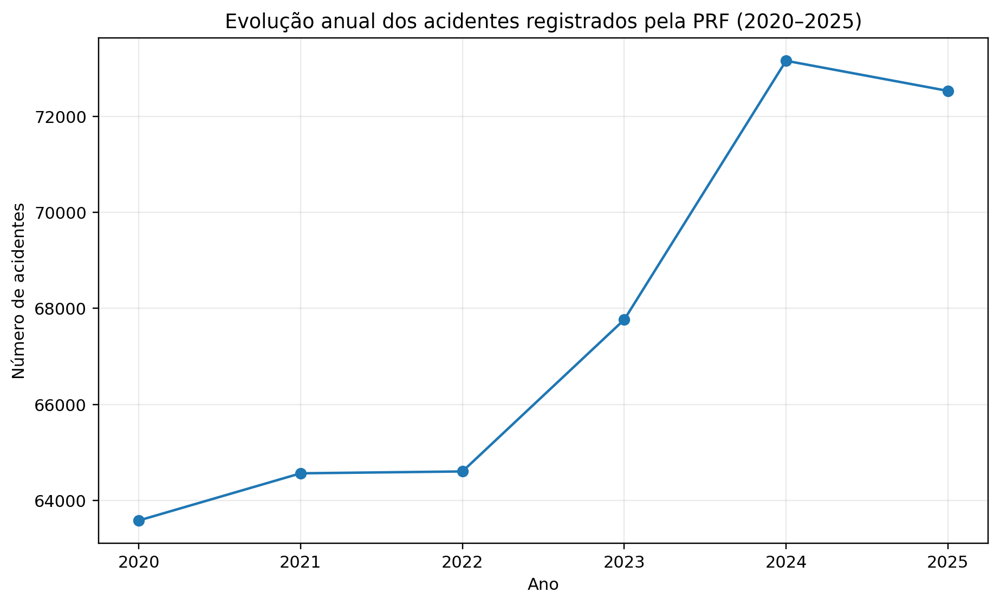
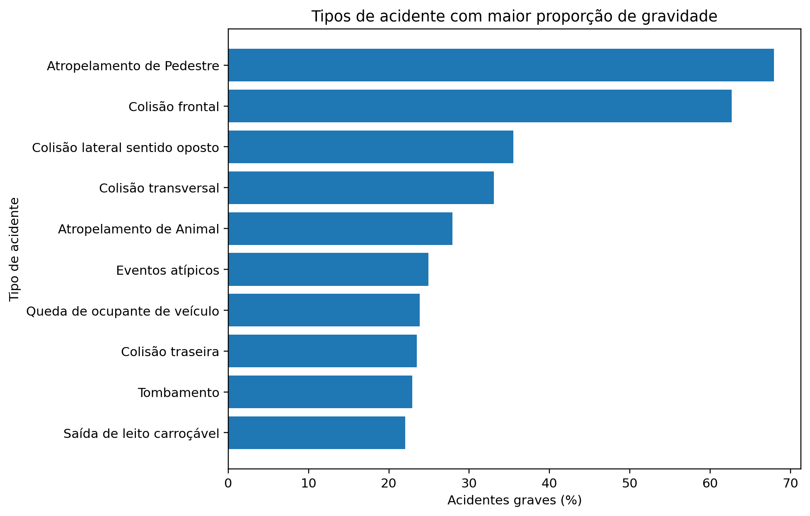
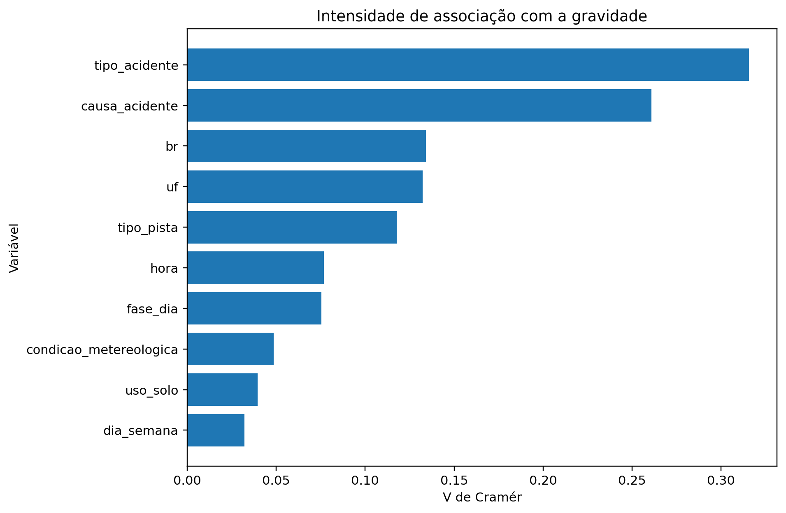
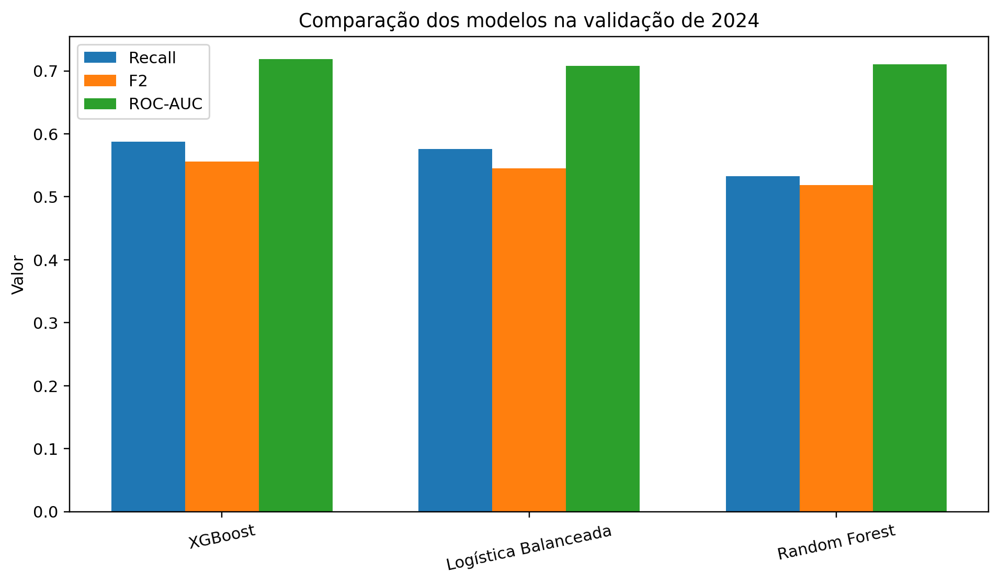
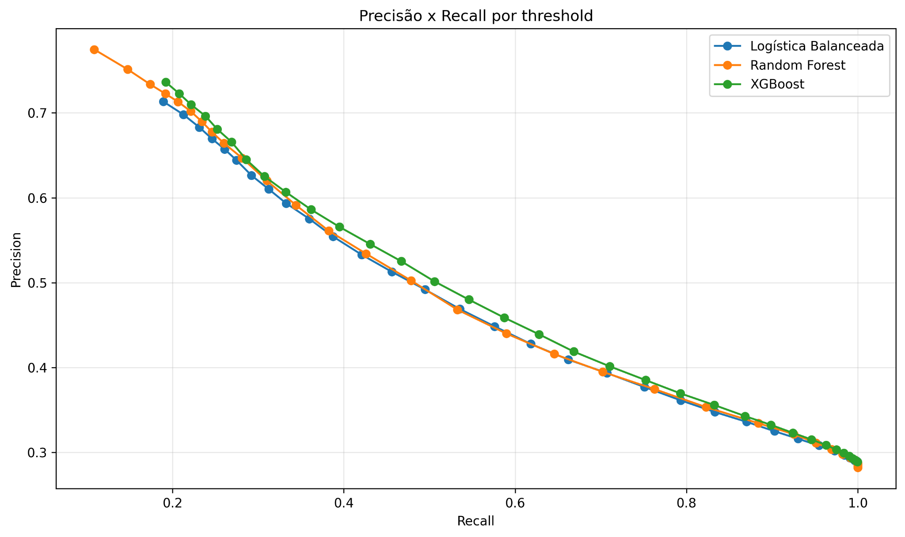
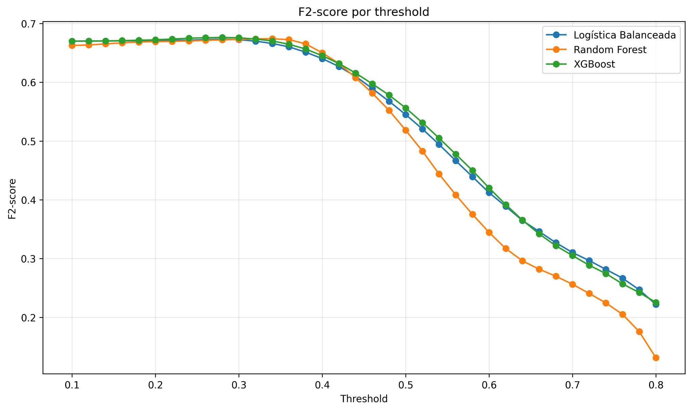
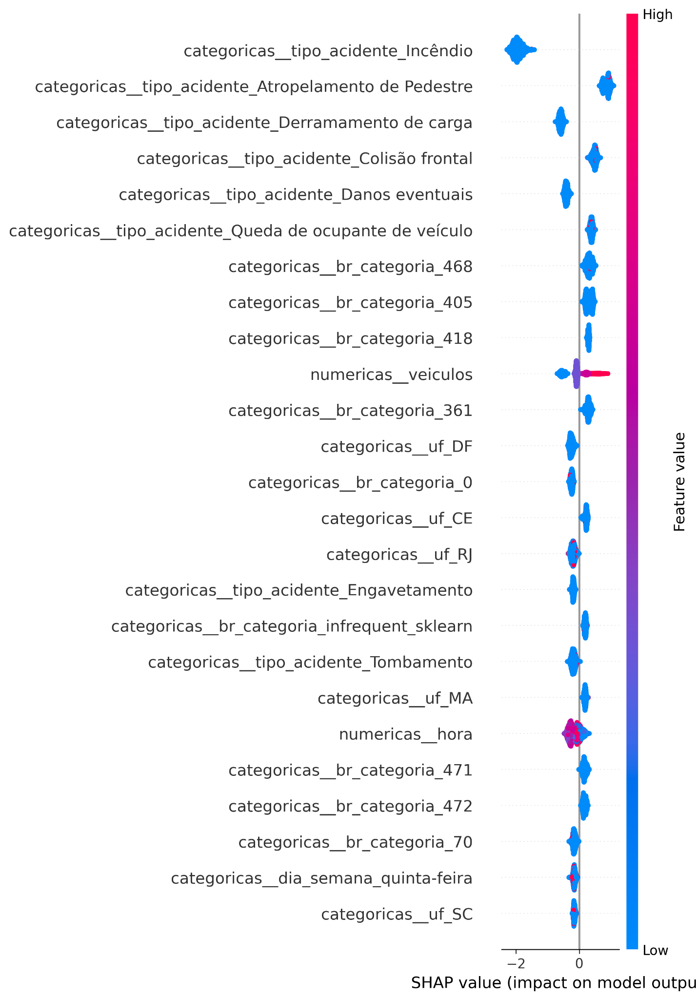

# TCC — Acidentes em Rodovias Federais com Machine Learning

Trabalho de Conclusão de Curso de **Denis Dorneles**, do curso de **Engenharia da Computação — UniFECAF**, com coorientação de **Rafaela da Silva**.

O projeto analisa os fatores associados à gravidade dos acidentes registrados nas rodovias federais brasileiras entre 2020 e 2025 e avalia técnicas de Machine Learning para classificar ocorrências graves ou fatais a partir dos dados públicos da Polícia Rodoviária Federal (PRF).

## Visão geral

- **Período analisado:** 2020–2025
- **Fonte:** Dados Abertos da Polícia Rodoviária Federal (PRF)
- **Unidade de análise:** acidentes agrupados por ocorrência
- **Base consolidada:** 406.209 acidentes
- **Variáveis originais:** 31
- **Base tratada (Silver):** 55 variáveis
- **IDs duplicados:** 0
- **Classe grave/fatal:** 114.309 ocorrências (28,14%)

> Os dados brutos não são versionados no repositório. O pipeline foi estruturado para reproduzir a coleta, integração e preparação dos arquivos públicos da PRF.

## Problema de pesquisa

**Quais fatores estão mais associados à gravidade dos acidentes de trânsito registrados nas rodovias federais brasileiras e como técnicas de Machine Learning podem ser utilizadas para identificar ocorrências com maior probabilidade de resultar em vítimas graves ou fatais?**

O estudo investiga **associações**, e não relações causais.

## Variável-alvo

Foi criada a variável binária `acidente_grave`:

- **0 — Não grave:** sem vítima gravemente ferida ou fatal;
- **1 — Grave/fatal:** pelo menos um ferido grave ou uma vítima fatal.

| Classe | Ocorrências | Participação |
|---|---:|---:|
| Não grave | 291.900 | 71,86% |
| Grave/fatal | 114.309 | 28,14% |

## Pipeline analítico

1. Coleta e integração dos arquivos anuais da PRF;
2. Auditoria de qualidade;
3. Tratamento e engenharia de atributos;
4. Análise Exploratória de Dados (EDA);
5. Análise de associação com Qui-quadrado e V de Cramér;
6. Construção dos experimentos de Machine Learning;
7. Comparação entre Regressão Logística, Random Forest e XGBoost;
8. Seleção do threshold com F2-score;
9. Interpretabilidade com Feature Importance e SHAP;
10. Teste temporal final com dados de 2025.

## Evolução dos acidentes



O volume anual passou de **63.585 ocorrências em 2020** para **72.529 em 2025**, enquanto a proporção de acidentes graves permaneceu relativamente estável, próxima de 28% ao longo da série.

## Principais resultados da análise exploratória

Entre os tipos de acidente, destacaram-se:

- **Atropelamento de pedestre:** 67,93% de acidentes graves;
- **Colisão frontal:** 62,67%;
- **Colisão transversal:** 33,06%;
- **Colisão lateral em sentido oposto:** 35,50%.



Outros padrões observados:

- pista simples: **33,52%** de gravidade;
- plena noite: **32,38%**;
- amanhecer: **30,23%**;
- taxa geral de acidentes graves: **28,14%**.

As comparações geográficas representam proporções dentro dos acidentes registrados e não medidas diretas de risco viário, pois o estudo não dispõe de variáveis de exposição como fluxo de veículos, quilometragem percorrida ou extensão da malha.

## Associação estatística

Foi utilizado o **V de Cramér** como medida de intensidade da associação entre variáveis categóricas e a classe de gravidade.

| Variável | V de Cramér | Interpretação |
|---|---:|---|
| Tipo de acidente | 0,316 | Forte |
| Causa do acidente* | 0,261 | Moderada |
| Rodovia (BR) | 0,134 | Fraca |
| UF | 0,132 | Fraca |
| Tipo de pista | 0,118 | Fraca |
| Hora | 0,077 | Muito fraca |
| Fase do dia | 0,075 | Muito fraca |

\* A variável `causa_acidente` foi analisada apenas entre 2021 e 2025 devido à alteração de taxonomia identificada nos registros de 2020.



## Machine Learning

Foram avaliados três algoritmos:

- Regressão Logística balanceada;
- Random Forest;
- XGBoost.

A validação foi estruturada temporalmente para reduzir vazamento de informação:

| Etapa | Período |
|---|---|
| Treino inicial | 2020–2023 |
| Validação e seleção | 2024 |
| Teste final independente | 2025 |

O conjunto de **2025 permaneceu bloqueado** até a definição do algoritmo, dos hiperparâmetros e do threshold.

### Comparação dos modelos



Na validação de 2024, o XGBoost apresentou o melhor desempenho global entre os modelos avaliados, com ROC-AUC de aproximadamente **0,719** e PR-AUC de **0,537** no threshold padrão.

## Seleção do threshold

Como o objetivo prioriza a identificação da classe grave, foi adotado o **F2-score**, que atribui maior peso ao recall.





Para o XGBoost, o maior F2-score no conjunto de validação de 2024 ocorreu com:

- **threshold:** 0,28;
- **precision:** 30,87%;
- **recall:** 96,29%;
- **F2-score:** 0,676.

Esse valor foi congelado antes da avaliação final de 2025.

## Interpretabilidade

Foram utilizadas duas abordagens:

- Feature Importance nativa do XGBoost;
- SHAP (SHapley Additive exPlanations).

As análises mostraram que **tipo de acidente**, **rodovia federal (BR)** e **UF** formam o principal conjunto de variáveis discriminantes do modelo.



O SHAP também mostrou que alta importância não significa necessariamente aumento da probabilidade de gravidade. Algumas categorias são importantes justamente por deslocarem as previsões para a classe não grave.

## Resultado final — teste de 2025

Após o congelamento das decisões metodológicas, o XGBoost foi treinado novamente com dados de **2020 a 2024** e avaliado uma única vez nos registros de **2025**.

| Métrica | Resultado |
|---|---:|
| Accuracy | 37,54% |
| Precision | 30,76% |
| Recall | **96,78%** |
| F1-score | 46,68% |
| F2-score | **67,71%** |
| ROC-AUC | **0,714** |
| PR-AUC | **0,529** |

### Matriz de confusão

|  | Previsto não grave | Previsto grave |
|---|---:|---:|
| Real não grave | 7.391 | 44.645 |
| Real grave | **660** | **19.833** |

Dos **20.493 acidentes graves registrados em 2025**, o modelo identificou corretamente **19.833**, correspondendo a **96,78% de recall**.

O modelo apresenta alta sensibilidade, mas também grande quantidade de falsos positivos. Por isso, os resultados devem ser interpretados como um experimento acadêmico de classificação e não como uma ferramenta operacional pronta.

## Estrutura do repositório

```text
.
├── README.md
├── requirements.txt
├── .gitignore
├── data/
│   ├── README.md
│   ├── raw/
│   └── processed/
├── docs/
│   ├── README.md
│   └── TCC_Denis_Dorneles.docx
├── figures/
│   ├── 01_evolucao_anual.png
│   ├── 02_tipo_acidente_gravidade.png
│   ├── 03_cramers_v.png
│   ├── 04_comparacao_modelos.png
│   ├── 05_precision_recall_threshold.png
│   ├── 06_f2_por_threshold.png
│   └── 07_shap_summary_plot.png
├── notebooks/
│   ├── 01_coleta_integracao.ipynb
│   ├── 02_auditoria_qualidade.ipynb
│   ├── 03_tratamento_base.ipynb
│   ├── 04_analise_exploratoria.ipynb
│   ├── 05_associacoes_estatisticas.ipynb
│   ├── 06_experimentos_machine_learning.ipynb
│   ├── 07_comparacao_modelos.ipynb
│   ├── 08_interpretabilidade_xgboost.ipynb
│   ├── 09_interpretabilidade_shap.ipynb
│   └── 10_teste_final_2025.ipynb
└── outputs/
    ├── eda/
    ├── estatistica/
    ├── modelos/
    ├── interpretabilidade/
    └── modelo_final/
```

## Ordem de execução dos notebooks

```text
01_coleta_integracao.ipynb
02_auditoria_qualidade.ipynb
03_tratamento_base.ipynb
04_analise_exploratoria.ipynb
05_associacoes_estatisticas.ipynb
06_experimentos_machine_learning.ipynb
07_comparacao_modelos.ipynb
08_interpretabilidade_xgboost.ipynb
09_interpretabilidade_shap.ipynb
10_teste_final_2025.ipynb
```

## Tecnologias

- Python
- Pandas
- NumPy
- SciPy
- Matplotlib
- Scikit-learn
- XGBoost
- SHAP
- PyArrow
- Joblib
- Jupyter Notebook / Google Colab

## Como reproduzir

```bash
python -m venv .venv
source .venv/bin/activate   # Linux/macOS
# .venv\Scripts\activate  # Windows

pip install -r requirements.txt
```

Depois, execute os notebooks na ordem indicada. O primeiro notebook realiza a coleta dos arquivos públicos da PRF e gera a base consolidada localmente.

## Cuidados metodológicos

- Variáveis de consequência, como `mortos`, `feridos_graves`, `feridos_leves`, `feridos`, `ilesos`, `pessoas` e `classificacao_acidente`, não foram usadas como preditoras, evitando **data leakage**.
- `causa_acidente` foi analisada separadamente devido à mudança de taxonomia.
- O threshold foi selecionado em 2024 e mantido fixo na avaliação final.
- O teste de 2025 não foi utilizado para retuning.
- Feature Importance e SHAP representam o comportamento do modelo, não causalidade.

## Artigo

A versão editável do trabalho está disponível em:

[**docs/TCC_Denis_Dorneles.docx**](docs/TCC_Denis_Dorneles.docx)

## Autor

**Denis Dorneles**  
**Engenharia da Computação — UniFECAF**

**Coorientadora:** Rafaela da Silva
